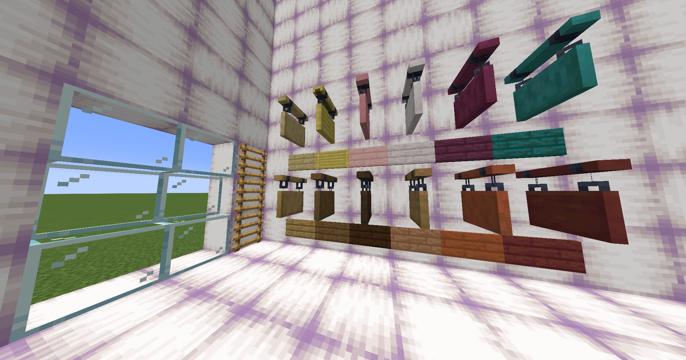
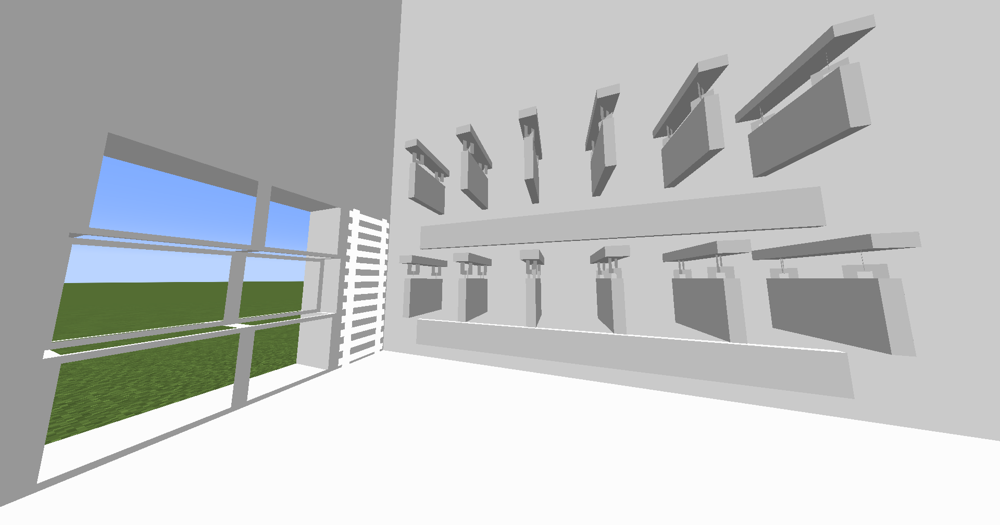

# October

Changes for Minecraft 1.21.4

# Resource Pack

- Download the latest version [here](https://github.com/VMPYRC/October/blob/main/resourcepack/October_1.21.4.zip)

## Changes

|          Before           |          After           |
| :-----------------------: | :----------------------: |
|  |  |

|         Item          |       Change Type       |
| :-------------------: | :---------------------: |
|   Glass, Glass Pane   | Clear with White Border |
|        Ladder         |          White          |
| Pearlescent Froglight |          White          |
|  Hanging Sign, Sign   |          White          |

## How to create your own resource pack

1. https://minecraft.wiki/w/Tutorial:Creating_a_resource_pack
2. `.minecraft\versions\`
3. Open the folder of the version you want to modify (Example: 1.21.4)
4. Right click the `.jar` file
5. Extract to a separate folder
6. Find what you want to modify
7. Modify it
8. Replicate the folder structure of the vanilla pack
   1. Example: `assets\minecraft\textures\entity\creeper\creeper.png`
9. Create a `pack.mcmeta` file
10. Create a `pack.png` file
11. ZIP all these files into one
    1. `pack.mcmeta`
    2. `pack.png`
    3. `assets` folder
12. Place the `.zip` file into your `.minecraft\resourcepacks`

# Resources Used

- https://minecraft.wiki/w/Pack_format
- https://minecraft.wiki/w/Resource_pack
- https://minecraft.wiki/w/Data_pack
- https://minecraft.wiki/w/Tutorial:Creating_a_resource_pack
- https://minecraft.wiki/w/Tutorial:Creating_a_data_pack
- https://minecraft.wiki/w/Non-renewable_resource
- https://crafting.thedestruc7i0n.ca/
